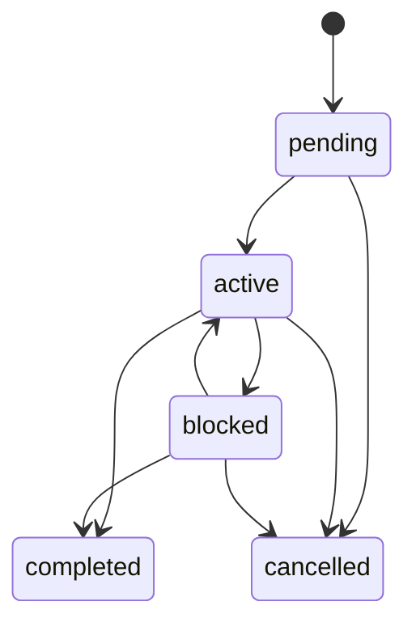

# Noct Board application protocol v1

Status: pre-1.0, implemented for evaluation.

## Noctweave binding

The direct application content type is `org.noctboard/event:1.0`; bounded
late-join re-encryption uses `org.noctboard/history:1.0`. A conforming group
credential advertises both `ContentTypeCapabilityV2` values in addition to
Noctweave's default content types.

Every direct event is wrapped as a strict signed-record payload inside a
Noctweave `GroupConversationEventV2` application event. The signed record holds
exact canonical Noct Board event bytes plus a domain-separated ML-DSA signature
by the author's group-scoped credential. Before projection, clients verify that
signature against the credential public key in accepted group state. The codec
then requires exact equality between the outer group event and the inner Noct
Board event for:

- event ID;
- client transaction ID;
- group/board ID (v1 maps them one-to-one);
- author member and credential handles;
- canonical millisecond timestamp.

Failure is quarantined as a binding error. Relays never decode this content.
V1 additionally requires `boardID == groupID`; clients do not accept a
separately selectable group UUID for a board.

Pre-projection container quarantine reasons are bounded to
`unexpectedContent`, `malformedPayload`, `envelopeBindingMismatch`,
`unauthorizedHistoryBootstrap`, and `invalidAuthorSignature`.

The direct signed-record object has exactly `schema` =
`org.noctboard/signed-event:1.0`, `eventBytes`, and `authorSignature`. The
signature input is `"org.noctboard.event-signature.v1"`, a zero byte, and the
SHA-256 digest of `eventBytes`. The history object has exactly `schema` =
`org.noctboard/history:1.0`, `boardID`, `groupID`, and
`signedEventRecordBytes`.

After admission, the immutable genesis owner may re-encrypt an exact signed
record in a strict history wrapper for the new epoch. The wrapper must bind the
same board/group, be group-authenticated by the genesis owner's active
credential, and contain a still-valid original-author signature. History is
exact-deduplicated before projection and exported with explicit attestation
provenance. It proves original group-credential attribution of the embedded
event, not the original outer envelope, delivery, ordering, completeness, or
pre-admission container-rejection trail.

The exact-key admission package includes `historyManifest` and `expiresAt`.
Each manifest entry has exactly `historyGroupEventID`, `eventID`, and
`signedEventRecordDigest`, where the digest is SHA-256 over the exact signed-
record bytes. Effective package expiry equals the join-anchor expiry and is the
minimum of the admission, prospective member's initial receive route, and every
included existing-member route expiry. The owner requires at least 15 minutes
between its pre-mutation check and that effective expiry.

Swift integrations must encode and decode the public request and package values
with `NoctBoardAdmissionCodec`. Their `Codable` conformance is an implementation
detail used by that strict NCJ-1 codec; raw `JSONEncoder` or `JSONDecoder` is not
wire-compatible because admission artifacts require canonical, duplicate-free,
exact-key JSON with bounded size and validated cross-field bindings.

## Crash-safe admission

Prospective preparation is an exact durable plan. Repeating it with the same
board, invitation binding, expiry, relay, route policy, and capabilities resumes
the one matching pending admission and route instead of minting another
credential. A conflicting plan fails closed.

Before an owner asks Noctweave to persist an epoch/member intent, it stores a
prepared journal containing the exact request digest, deterministic idempotency
key, base-state anchor, existing-member routes, signed history records,
manifest, and effective expiry. Epoch transport and every history publication
resume from that journal. Once derived, the canonical package bytes and digest
are persisted; a completed journal returns those exact package bytes on retry.
If a still-prepared plan no longer has the 15-minute handoff margin, the owner
aborts it before mutation so a fresh request can be planned. A plan that already
mutated resumes only its matching durable intent and operations.

On the joining endpoint, completion validates the exact request/package and
durably stores a pending receipt before accepting the join anchor, transition,
or Welcome. It then synchronizes all bounded pages and verifies every manifest
entry against a received, author-signature-verified history record before
marking the receipt verified. Exact retry resumes matching persisted admission
progress after a transient failure; it never reconstructs a replacement join.
An expired fresh package, conflicting retry, or absent/mismatched declared
record fails closed. The independently authenticated encrypted invitation
channel must protect the package and manifest. Manifest verification proves
completeness only for the genesis owner's declared pre-admission set, not that
the declaration contains every prior board event.

The private admission-state sidecar is
`<state-path>.noctboard-private/admission-state.json`. It is encrypted by
default and plaintext only in explicit testing mode. Non-genesis board APIs
require a verified receipt bound to the installed local credential, origin join
anchor, admission digest, and retained declared manifest. The sidecar must be
preserved and moved with client state; missing state is never reconstructed from
the group runtime. V1 does not independently rollback-anchor this sidecar.

## Canonical event

Events are strict canonical JSON objects with exactly these fields:

```text
schema                         "org.noctboard/event:1.0"
id                             non-zero UUID
clientTransactionID            non-zero UUID
boardID                        non-zero UUID
groupID                        non-zero UUID
authorMemberHandle             board-scoped Noctweave handle
authorCredentialHandle         board-scoped Noctweave credential
logicalClock                   integer <= 2^53-1
authorSequence                 zero-based integer <= 2^53-1
previousAuthorEventDigest      null for sequence 0, otherwise 32 bytes
createdAtUnixMilliseconds      bounded claimed time
operation                      exact { type, payload }
```

The maximum canonical event size is 32 KiB. Unknown, missing, duplicate, or
extra object fields are rejected. Strings must be Unicode NFC and may not
contain control characters other than tab/newline/carriage-return in the two
explicit multiline fields.

`logicalClock` is the primary deterministic presentation-order key, followed
by claimed time, event UUID, and digest. Claimed time is authenticated metadata,
not an authorization clock. Each author's accepted transport stream begins at
sequence zero and hashes the canonical preceding event. A structurally valid
but application-unauthorized event consumes the author's chain position so it
remains visible without wedging all later events. A missing predecessor,
conflicting sequence, event-ID conflict, or transaction replay is rejected and
recorded. After the first retained event, an authenticated consumed chain link
may advance the current maximum logical clock by at most one; a larger jump is
recorded as `logicalClockGap` rather than letting one member force arbitrary
presentation order.

## Operations

| Type | Payload | Accepted author |
| --- | --- | --- |
| `thread.create` | `threadID`, bounded `title` | coordinator |
| `thread.close` | `threadID` | coordinator |
| `task.create` | `taskID`, `threadID`, `title`, optional `details`, optional worker assignee | coordinator |
| `task.assign` | `taskID`, optional worker assignee | coordinator; a worker may claim an unassigned task only for itself |
| `task.transition` | `taskID`, exact `from`, exact `to` | coordinator, or assigned worker except cancellation |
| `message.post` | `messageID`, `threadID`, optional `taskID`, bounded `body` | coordinator or worker |
| `member.set-role` | `memberHandle`, `coordinator`/`worker`/`auditor` | coordinator |

An auditor has no accepted write operation. The final coordinator cannot be
demoted. A thread cannot close while it contains a nonterminal task, and a
worker with a nonterminal assignment cannot change to a non-worker role. A role
event changes application authorization only; Noctweave group membership and
credentials remain the cryptographic authority. These roles constrain
conforming clients; sender-controlled ordering fields mean a malicious admitted
raw endpoint can backdate around a role downgrade. Credential removal and epoch
rotation are the actual future-write cutoff and terminate the usable v1 segment.

Message bodies and task details are untrusted plaintext after decryption. They
are displayed as text and cannot grant a role, carry an executable command, or
authorize an external effect.

## Task state machine



Terminal tasks cannot be reassigned or transitioned. A transition includes its
expected prior state; a stale concurrent transition is rejected rather than
being silently rebased.

## Projection and ledger

All events are sorted canonically and replayed from an explicit configuration
derived from verified group membership plus initial product roles. Projection
contains the current roles, threads, tasks, task-linked/unlinked messages, and
accepted event IDs. Delivery order does not change the result.

Every event produces one ledger outcome:

- `accepted`: mutated or validly extended application state;
- `replayed`: byte-identical event ID observed again, with no mutation;
- `rejected`: authenticated evidence that failed board/group binding, author
  credential, chain, replay, authorization, dependency, or state-transition
  checks.

These outcomes are deterministic for the complete retained event set, not an
append-only record of the first locally observed verdict. A later authenticated
event that sorts earlier can reclassify an existing rejection reason while the
exact event remains retained and rejected. Event ID plus the retained-set
projection digest therefore scope a ledger comparison.

The unsigned redacted audit JSONL contains a header, ordered application-ledger
records, pre-decode `recordType: "containerRejection"` records, explicit
late-join `recordType: "historyAttestation"` records, and a summary with
`containerRejectedCount`, `historyAttestationCount`, the other verdict counts, and
a SHA-256 digest of the canonical final projection. It intentionally omits
task/message text and replay inputs. The CLI/UI importer performs structural
and count consistency checks only. The standalone audit UI starts with a
deterministic fixture and can separately open an authorized encrypted live
client state for full local projection.

## Bounds

- Active/historical authorization entries: at most 128 for the MVP.
- Thread title: 160 UTF-8 bytes.
- Task title: 200 UTF-8 bytes.
- Task details: 8 KiB UTF-8.
- Message body: 16 KiB UTF-8.
- Canonical event: 32 KiB.
- Auditable retained application events: 3,000; honest v1 clients refuse more.
- Late-join history at admission: at most 128 retained application events; one
  additional signed wrapper per event consumes the same 3,000-event window.
- Time range: 2020-01-01 through 2200-01-01 UTC in integer milliseconds.

Noctweave's tighter group, packet, route, runtime, and state-store limits also
apply. If an admitted bypass client forces runtime compaction/overflow,
snapshot fails because v1 has no checkpoint/base-state recovery. This protocol
never relaxes Noctweave's limits.
